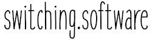

**switching.software** is a collection of ethical, easy-to-use and privacy-conscious alternatives to well-known software.

## License

[Switching.software](https://switching.software) is based on the work of [switching.social](https://web.archive.org/web/20190915101437/https://switching.social/). There has been a lot of adaptions since its shutdown in September 2019. We added graphics, rearranged entries, updated texts and much more. Nevertheless, it still guides us on our way.

All content was, is and will always be licensed as [CC BY-SA 4.0](https://creativecommons.org/licenses/by-sa/4.0/).

## Surroundings

This site is only possible thanks to free and open projects like:

- [switching.social](https://web.archive.org/web/20190915101437/https://switching.social/): The original site, that went offline in September 2019, but was restored [here](https://codeberg.org/swiso-en/archive)
- [Hugo](https://gohugo.io/): A powerful open-source static site generator 
- [Codeberg.org](https://codeberg.org/): A non-profit and non-government organization, that gives our codebase a home - powered by [Gitea](http://gitea.io/).

## Contribute

We try our best to refurbisch, update and maintain this website. Right now, we are preparing the first release to replace the original "switching.social" backup.

Nevertheless, this project has a lot of content. So please, have a look around and **open an issue in case you find mistakes** or deprecated information. 

We also **appreciate your proposals** and ideas for new content. If you want to create some yourself, feel free to fork this repository and send us a pull request with your changes. 

Currently used Hugo version: v0.61.0