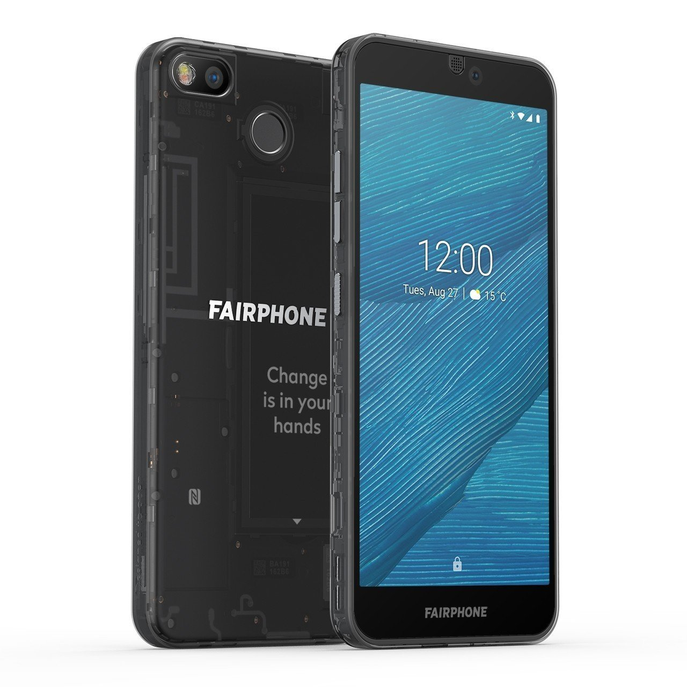

Ok, this isn’t strictly speaking to do with privacy, but as this site is about ethical internet-related stuff we thought you might want to know about ethically-made phones as well.

### Fairphone
Fairphone tries to get as much of its raw materials as possible from sources with decent working conditions and fair wages. The latest model, the Fairphone 3, also uses a modular design so that if one part breaks you can easily replace it yourself without having to buy a new phone.

The phone’s software is Android, and it will work just like any other Android phone. The price may seem a bit high, but the manufacturers are transparent about where the money goes, and this is how much a phone costs to make when you pay people fairly all the way down the supply chain.


- **Website:**
    - [Fairphone](https://www.fairphone.com/)

